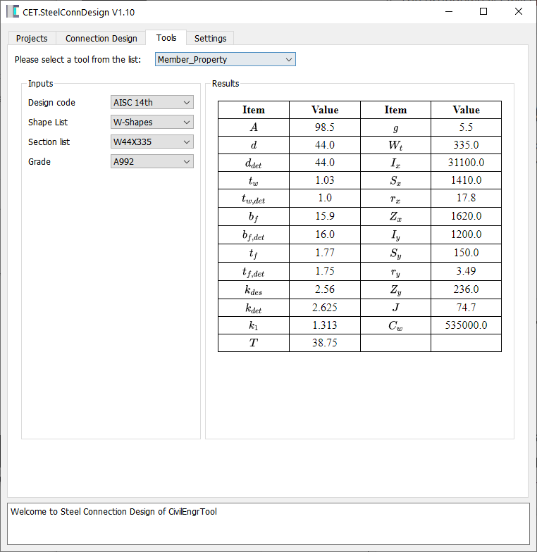
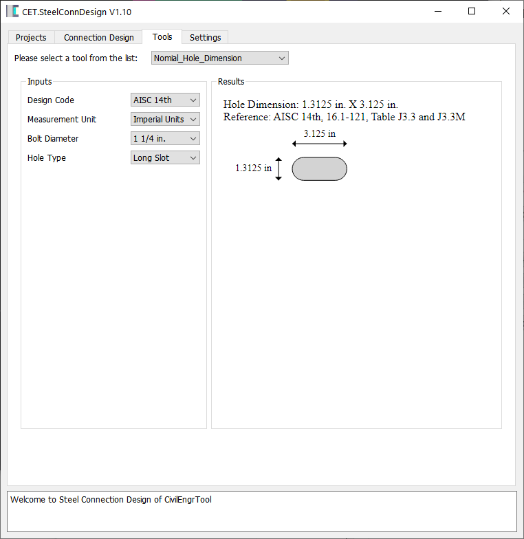

<h1 style="text-align: center;">The Plugin System of CET.SteelConnDesign</h1>

### Table of Contents

1. [Introduction](#introduction)
2. Development Setup (Windows Only)
   - [Conda and Git Installation](#conda-and-git-installation)
   - [Step 1: Download the Installer](#step-1-download-the-installer)
   - [Step 2: Run the Installer](#step-2-run-the-installer)
   - [Step 3: Configure PATH (Optional)](#step-3-configure-path-optional)
   - [Step 4: Complete Installation](#step-4-complete-installation)
   - [Step 5: Verify Installation](#step-5-verify-installation)
   - [Step 6: Setup Python 3.8.6](#step-6-setup-python-386)
3. Plugin Development
   - [Step 1: Add Packages to Python](#step-1-add-packages-to-python)
   - [Step 2: Run Plugins](#step-2-run-plugins)
   - [Step 3: Contribute to Code](#step-3-contribute-to-code)
   - [Step 4: Update Plugins](#step-4-update-plugins)
4. Plugin Structure
   - [Folder and File Requirements](#folder-and-file-requirements)
   - [Example Structure](#example-structure)
5. Existing Plugins
   - [Member Property](#member-property)
   - [Nominal Hole Dimension](#nominal-hole-dimension)

# Introduction

**[CET.SteelConnDesign](https://github.com/CivilEngrTools/SteelConnDesign)** is a FREE, cutting-edge steel connection design software built on the AISC 13th/14th/15th standards and powered by modern mathematical theories, providing users with a powerful design solution.  

**CET.SteelConnDesign** embraces open-source principles for engineering and is exploring the possibility of transitioning to an Open-Source model in the future. The introduction of plugins is our first step in this direction. This system is designed to offer valuable tools that assist users in their designs while also enabling them to share their innovative ideas with the community.  

Some plugins, such as the Member Property Plugin, require the “CET_MODULE.cp38-win_amd64.pyd” file, located in the CET.SteelConnDesign installation directory (`C:\Users\<User Name>\AppData\Roaming\CET_SteelConnDesign\`, replacing `<User Name>` with your actual username). However, this file is not necessary for developing your own plugins.

# Development Setup (Windows Only)  

### Conda and Git Installation
*Skip this section if Conda and Git are already installed on your computer.*

---

### Step 1: Download the Installer  
- Go to the official [Anaconda](https://www.anaconda.com/) or [Miniconda](https://docs.conda.io/en/latest/miniconda.html) website.  
  - Download **Anaconda** for a full package or **Miniconda** for a minimal installation.  
  - Choose the installer for your system (32-bit or 64-bit).  

---

### Step 2: Run the Installer  
1. Double-click the downloaded `.exe` file to start the installation.  
2. Follow the setup wizard:  
   - Agree to the license agreement.  
   - Choose **Just Me** (recommended) or **All Users**.  
   - Select the installation location (default is fine).  

---

### Step 3: Configure PATH (Optional)  
- When prompted, **do not** check the option to "Add Anaconda/Miniconda to my PATH environment variable" (recommended).  
- Use the **Anaconda Prompt** or **Miniconda Prompt** instead to avoid conflicts.  

---

### Step 4: Complete Installation  
1. Click **Install** and wait for the process to complete.  
2. Launch the **Anaconda Prompt** or **Miniconda Prompt** from the Start Menu.  

---

### Step 5: Verify Installation  
1. Open the **Anaconda Prompt** or **Miniconda Prompt**.  
2. Run:  
    ```bash
    conda --version
    ```

---

### Step 6: Setup Python 3.8.6  
1. Create a new environment:  
    ```bash
    conda create -n py38 python=3.8
    ```
2. Activate the environment:  
    ```bash
    conda activate py38
    ```

# Plugin Development  

---

### Step 1: Add Packages to Python  
1. Install Git:  
    ```bash
    conda install git
    ```
2. Install PySide2:  
    ```bash
    pip install PySide2
    ```

---

### Step 2: Run Plugins  
1. **Install** **[CET.SteelConnDesign V1.10](https://github.com/CivilEngrTools/SteelConnDesign/releases/tag/1.10)** or a later version and ensure `CET_MODULE.cp38-win_amd64.pyd` is in the following directory: `C:\Users<User Name>\AppData\Roaming\CET_SteelConnDesign\` *(Replace `<User Name>` with your actual username.)*  

2. Clone the plugin repository:  
 ```bash
 git clone https://github.com/CivilEngrTools/SteelConnDesign_plugins
 ```

3. Open the cloned directory in **VSCode** and run `test_plugins.py`.  

---

### Step 3: Contribute to Code  
1. Ensure you have a **GitHub account** and fork the [SteelConnDesign_plugins](https://github.com/CivilEngrTools/SteelConnDesign_plugins) repository.  
2. Clone the forked repository to a **different local directory** (different from Step 2):  
 ```bash
 git clone <your-forked-repo-url>
 ```
3. Create a new branch:  
 ```bash
 git checkout -b <new-branch-name>
 ```
4. Develop a new plugin or make your changes.  
5. Commit and push your changes after testing:  
 ```bash
 git add .
 git commit -m "Description of changes"
 git push origin <new-branch-name>
 ```
6. **Create a pull request:**  
- Go to your forked repository on GitHub.  
- Click **Compare & pull request**.  
- Add a title and description.  
- Ensure the base repository is the original project with `main` (or `master`) as the base branch.  
- Submit the pull request.  

7. Once your pull request is approved, your plugins will appear in the next release.  
- You can still use them locally. Refer to **Step 4** for details.  

---

### Step 4: Update Plugins  
1. If you have developed your own plugins, copy them to the following directory after testing:  
 ```
 C:\Users\<User Name>\AppData\Roaming\CET_SteelConnDesign\plugins
 ```
 Your plugin will be **automatically loaded** when you run CET.SteelConnDesign and will appear in the plugins dropdown list.  
 - Refer to [User Manual](https://github.com/CivilEngrTools/SteelConnDesign/blob/main/User%20Manual.pdf) Section **5.2.3** for details on the required file structure.  

2. To **update plugins**, run the following command in the plugin installation directory:  
 ```bash
 git pull https://github.com/CivilEngrTools/SteelConnDesign_plugins
 ```

# Plugin Structure  

Plugins are organized using folders and files, where the **folder name** corresponds to the plugin name displayed in the plugin dropdown list.  

---

## Folder and File Requirements  
- Each **plugin folder** must include a `plugin.py` file.  
- In `plugin.py`, specify the following fields:  
  - `author`: Name of the plugin creator.  
  - `description`: Brief description of the plugin's functionality.  
  - `category`: Category under which the plugin will be grouped.  
  - `load_order`: Order in which the plugin is loaded.  

- Ensure the class is named:  
    ```python
    PluginUI(QWidget)
    ```

---

## Example Structure  
CET_SteelConnDesign\plugins  
&nbsp;  
----Member_Property  
&nbsp; &nbsp; |----plugin.py  
----Nominal_Hole_Dimension  
&nbsp; &nbsp; |----plugin.py 

- In this example:  
  - The dropdown list will show **Member_Property** and **Nominal_Hole_Dimension** as plugin names.  
  - Each folder has its own `plugin.py`, maintaining modular and organized code.

# Existing Plugins

## Member Property  
This plugin allows users to quickly check member properties without referring to book tables. It currently supports **AISC 13th, 14th, and 15th edition** shape data, including:  
- **W-shapes**  
- **Angles**  
- **Rectangular HSS shapes**  

  

---

## Nominal Hole Dimension  
This plugin calculates hole dimensions based on **AISC 13th, 14th, and 15th editions**, referencing **Tables J3.3 and J3.3M**. It supports:  
- **Imperial and metric units**  
- **Standard, oversized, and slotted holes**  
- **Visual representation of slotted hole dimensions**  


